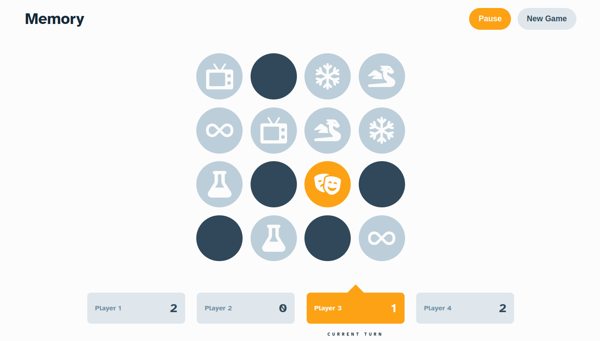
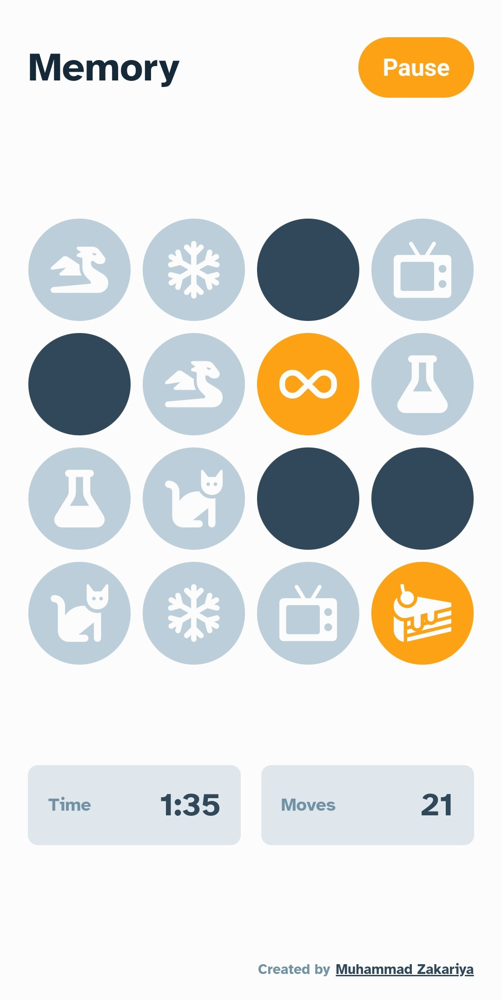

# **Memory Game**

**Screenshot -**

**Mobile screenshots -**

	
	 
	

**Made using -**
- React + Typescript
- Sass / SCSS
- Icon components are custom-made (by selecting individual icons from [Font Awesome](https://fontawesome.com/) and [Flaticon](https://www.flaticon.com/) in the form of SVG and converting them into JSX components using [SVG to JSX](https://svg2jsx.com/))
- **No additional libraries used**

**Notes -**

I took on this project as a [challenge](https://www.frontendmentor.io/challenges/memory-game-vse4WFPvM) from Frontend-Mentor, a website that offers a wide range of interesting front-end development projects. Although I'm not actively trying to complete these challenges, I found this one to be particularly intriguing. It served as a fun side project for me and it was the first game application I have ever made.

**Learnings -**

During the development of this project, I didn't encounter many difficulties in building the game logic, 
and there weren't any surprises or unexpected behavior in the code. However, I did learn several things 
while working on it. Some of these include:
- Creating a timer that utilizes the current time and understanding the advantages of using this approach over incrementing a value with a `setInterval` of 1 second.
- Utilizing a `hash-set` instead of an `array` for faster access time when reading frequently accessed values.
- Implementing the popular `Fisher-Yates algorithm` for random shuffle.
- Gaining a better understanding of when to use `state`, `reducer` and `context` in a project.

Overall, this project was a great learning experience for me, and I've come away from it with a deeper understanding of these concepts and techniques, as well as honing my skills in React and TypeScript.

**To run in your local server -**

- `Clone` the respository
- `npm install` - To install project dependencies
- `npm start` - To start the development server
