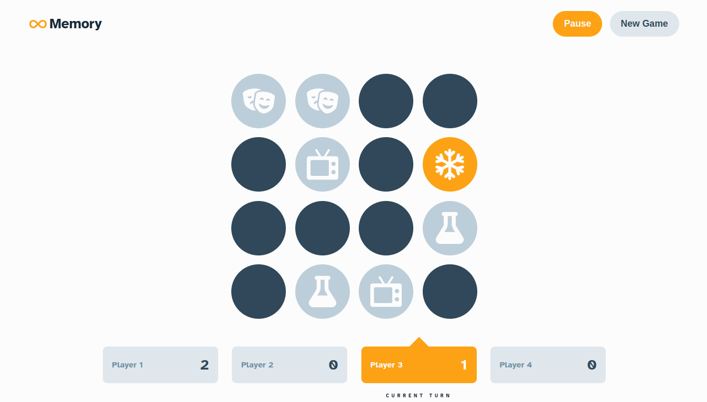

# **Memory Game**

**Made using -**
- React
- Typescript
- Sass

**Notes -**

This project is a challenge from Frontend Mentor ([link](https://www.frontendmentor.io/challenges/memory-game-vse4WFPvM)). FM is an excellent website with many interesting projects focusing on frontend development. Though I'm not looking to complete these challenges, I found this one to be intriguing enough to give it a try. It was a fun side project for me, and the first "game app" I ever made.

**Learnings -**

For the most part, I didn't have much trouble building up the game logic, and there weren't any surprises or unexpected behaviour in the code. Nonetheless, there were quite a few things that I learned during the course of development of this project. Some of these include -
- Creating a timer using current time (`Date.now`) and why it is more appropriate than simply incrementing a value on each interval cycle
- Using `hash set` instead of `array` to provide a faster access time for values that would be read frequently
- Implementing the popular algorithm for random shuffle i.e. `Fisher-Yates Algorithm`
- A clearer idea on when to use `state`, `reducer` and `context` each

More about logic and problem solving approach [here](src/README.md).

**To run in your local server -**

- `Clone` the respository
- `npm install` - To install project dependencies
- `npm start` - To start the development server
